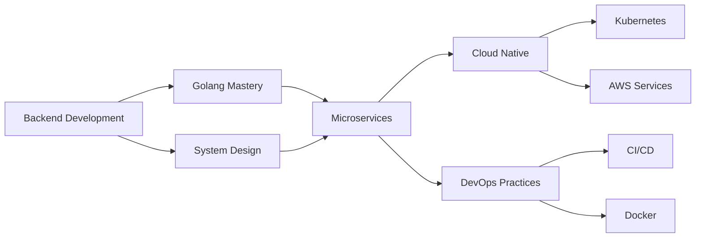

<div align="center">
  
</div>

<p align="center">
  
</p>

<p align="center">
  
  
  
</p>

<br/>

<!-- Profile Picture Section -->
<table align="center">
<tr>
<td width="50%" align="center">
  
</td>
<td width="50%" valign="top">

### 👨‍💻 Quick Facts

- 👋 Hi, I'm **@navneetshukl**
- 👀 Interested in **Backend Development**
- 🌱 Currently learning **Low Level System**
- 💞️ Looking to collaborate on **Projects**
- ✍️ Writing blogs on [**HashNode**](https://hashnode.com/@navneets)
- 💡 Most of my time is spent on **computer screen**
- 🎯 Passion: Understanding **how systems work**

</td>
</tr>
</table>

<br/>

---

## 💼 Professional Summary

<div align="center">

```javascript
const navneet = {
  code: ["Golang", "C++", "Python"],
  askMeAbout: [
    "DevOps",
    "Backend Development",
    "Competitive Programming",
    "MongoDB",
    "MySQL",
    "PostgreSQL",
    "REST APIs",
    "AWS",
    "Docker",
    "CI/CD",
    "Data Structures",
    "Algorithms",
    "Kafka",
    "Kubernetes",
  ],
  technologies: {
    frontend: ["HTML", "CSS", "JavaScript", "React.js", "Tailwind CSS", "Bootstrap"],
    backend: ["Golang", "Gin", "Fiber", "MongoDB",  "PostgreSQL", "MySQL"],
    devops: ["AWS", "Docker","Kubernetes", "Git", "CI/CD"]
  }
};
```

</div>

<br/>

---

## 🏆 Achievements & Trophies

<div align="center">
  
</div>

<br/>

---

## 📈 GitHub Analytics

<table align="center">
<tr>
<td width="50%" align="center">
  
  
  
</td>
<td width="50%" align="center">
  
  
  
</td>
</tr>

<tr>
<td width="50%" align="center">
  
  
  
</td>
<td width="50%" align="center">
  
  
  
</td>
</tr>
</table>

<br/>

---

## 🔥 Contribution Graph

<div align="center">
  
</div>

<br/>

<div align="center">
  <picture>
    <source media="(prefers-color-scheme: dark)" srcset="./profile-3d-contrib/profile-green-animate.svg">
    <source media="(prefers-color-scheme: light)" srcset="./profile-3d-contrib/profile-green-animate.svg">
    
  </picture>
</div>

<br/>

---

## ⏱️ Weekly Development Breakdown

<div align="center">

<!--START_SECTION:waka-->
```txt
Other    22 hrs       ████████████████████████▓   91.67 %
Golang   2 hrs        ▒░░░░░░░░░░░░░░░░░░░░░░░░   08.33 %
```
<!--END_SECTION:waka-->

</div>

<br/>

---

## 🛠️ Technology Stack

<details open>
<summary><b>🔧 Languages</b></summary>
<br/>

<div align="center">


</div>
</details>

<details open>
<summary><b>🎨 Frontend Technologies</b></summary>
<br/>

<div align="center">


</div>
</details>

<details open>
<summary><b>⚙️ Backend & Databases</b></summary>
<br/>

<div align="center">


</div>
</details>

<details open>
<summary><b>☁️ DevOps & Cloud Tools</b></summary>
<br/>

<div align="center">


</div>
</details>

<br/>

---

## 💡 Core Competencies

<details>
<summary><b>📋 Detailed Skills & Expertise</b></summary>
<br/>

<table>
<tr>
<td width="50%" valign="top">

### Programming Languages
- **Golang** (Primary)
- **Python**
- **C++**
- JavaScript

### Backend Development
- REST API Design
- Microservices Architecture
- Database Design
- Message Queuing (Kafka)

### DevOps & Cloud
- Amazon Web Services (AWS)
- Docker & Kubernetes
- CI/CD Pipelines
- Git Version Control

</td>
<td width="50%" valign="top">

### Core Computer Science
- **Data Structures** & Algorithms
- **Computer Networks**
- **Database Management**
- System Design
- Linux Administration

### Soft Skills
- Problem Solving
- Strong Communication Skills
- Team Collaboration
- Creativity
- Continuous Learning

### Databases
- MongoDB
- PostgreSQL
- MySQL

</td>
</tr>
</table>

</details>

<br/>

---

## 🎯 What I'm Up To

<table>
<tr>
<td width="50%">

### 🔭 Current Focus
```yaml
learning: "Low Level System Design"
exploring: "Distributed Systems"
building: "Scalable Backend Services"
```

</td>
<td width="50%">

### 🌟 Goals for 2025
```yaml
- Master Kubernetes & Cloud Architecture
- Contribute to Open Source Projects
- Build Production-Grade Systems
- Write Technical Blog Posts
```

</td>
</tr>
</table>

<br/>

---

## 📝 Latest Blog Posts

<div align="center">

### ✍️ My Recent Articles on HashNode

<!-- BLOG-POST-LIST:START -->
<!-- BLOG-POST-LIST:END -->

<a href="https://hashnode.com/@navneets" target="_blank">
  
</a>

</div>

<br/>

---

## 💻 Coding Profiles & Competitive Programming

<div align="center">

<table>
<tr>
<td align="center" width="50%">

### 🏅 LeetCode Stats
[](https://leetcode.com/u/navneetshukla824/)

</td>
<td align="center" width="50%">

### 📊 Problem Solving Journey
```
🎯 Focus Areas:
   • Data Structures
   • Algorithms
   • System Design
   • Competitive Programming

💪 Daily Practice:
   • Solving coding challenges
   • Optimizing solutions
   • Learning new patterns
```

</td>
</tr>
</table>

</div>

<br/>

---

## 🌐 Connect With Me

<div align="center">

<table>
<tr>
<td align="center" width="20%">
<a href="https://x.com/34_shukla" target="_blank">

</a>
</td>
<td align="center" width="20%">
<a href="https://www.linkedin.com/in/navneet-shukla-19a97a1a0/" target="_blank">

</a>
</td>
<td align="center" width="20%">
<a href="https://hashnode.com/@navneets" target="_blank">

</a>
</td>
<td align="center" width="20%">
<a href="https://github.com/navneetshukl" target="_blank">

</a>
</td>
<td align="center" width="20%">
<a href="https://leetcode.com/u/navneetshukla824/" target="_blank">

</a>
</td>
</tr>
</table>

</div>

<br/>

---

## 💭 Random Dev Quote

<div align="center">


</div>

<br/>

---

## 🎓 Learning & Development Path

<div align="center">



</div>

<br/>

---

## 📫 How to Reach Me

<div align="center">

### Let's collaborate on exciting projects! 🚀

| Platform | Link |
|----------|------|
| 💼 LinkedIn | [Connect with me](https://www.linkedin.com/in/navneet-shukla-19a97a1a0/) |
| 🐦 Twitter | [Follow me](https://x.com/34_shukla) |
| 📝 Blog | [Read my articles](https://hashnode.com/@navneets) |
| 💻 LeetCode | [View my solutions](https://leetcode.com/u/navneetshukla824/) |

</div>

<br/>

---

<div align="center">

### ⚡ Fun Fact

> *"Most of my time is spent on computer screen, understanding how systems work and building things that matter!"*

</div>

<br/>

<div align="center">
  
</div>

<div align="center">
  
**⭐ From [navneetshukl](https://github.com/navneetshukl) | 💙 Open to Collaboration**

</div>
