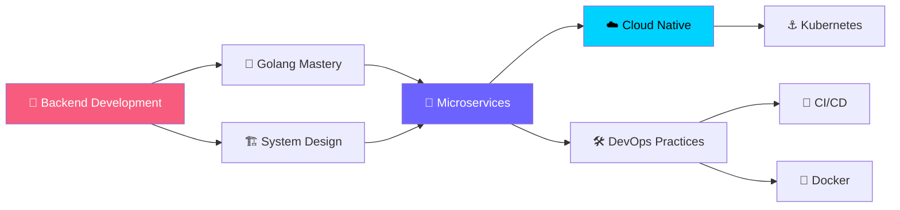

<div align="center">
  
</div>

<p align="center">
  
</p>

<p align="center">
  
  &nbsp;
  
  &nbsp;
  
</p>

---

## 👨‍💻 About Me


```go
package main

import "fmt"

type Developer struct {
    Name        string
    Role        string
    Languages   []string
    Interests   []string
    Location    string
}

func main() {
    me := Developer{
        Name:      "Navneet Shukla",
        Role:      "Backend Developer",
        Languages: []string{"Go", "Python", "C++", "JS"},
        Interests: []string{
            "Low Level System Design",
            "Distributed Systems",
            "Cloud Native Apps",
            "Competitive Programming",
        },
        Location: "India",
    }
    fmt.Printf("Hello World! I'm %s 👋\n", me.Name)
}
```

<br clear="right"/>

---

## 🛠️ Technology Stack

<h3 align="center">⚡ Languages</h3>
<p align="center">
  
</p>

<h3 align="center">🚀 Backend & Databases</h3>
<p align="center">
  
</p>

<h3 align="center">🐳 DevOps & Infrastructure</h3>
<p align="center">
  
</p>

<h3 align="center">🔧 Tools & Platforms</h3>
<p align="center">
  
</p>

---

## 🏆 GitHub Trophies

<p align="center">
  
</p>

---

## 📈 GitHub Analytics

<p align="center">
  
  &nbsp;&nbsp;
  
</p>

---

## 💻 Language Usage & Distribution

<p align="center">
  
  &nbsp;&nbsp;
  
</p>

<p align="center">
  
  &nbsp;
  
  &nbsp;
  
</p>

<p align="center">
  
</p>

---

## 🔥 Contribution Graph

<p align="center">
  
</p>

<p align="center">
  
</p>

---

## 🗺️ Learning & Development Path


```mermaid
graph LR
    A[🔧 Backend Development] --> B[🐹 Golang Mastery]
    A --> C[🏗️ System Design]
    B --> D[🔬 Microservices]
    C --> D
    D --> E[☁️ Cloud Native]
    E --> F[⚓ Kubernetes]
    D --> H[🛠️ DevOps Practices]
    H --> I[🔄 CI/CD]
    H --> J[🐳 Docker]
    style A fill:#f75c7e,color:#fff
    style D fill:#6c63ff,color:#fff
    style E fill:#00d2ff,color:#000
```

---

## 🎯 What I'm Up To

<table width="100%">
  <tr>
    <td width="50%" valign="top">
      <h3>🔭 Current Focus</h3>
      
- 🏗️ **Low Level System Design** — building from ground up
- 🌐 **Distributed Systems** — consistency, availability, fault tolerance
- ⚡ **Scalable Backend Services** — high throughput, low latency
    </td>
    <td width="50%" valign="top">
      <h3>🌟 Goals for 2026</h3>
      
- ☸️ **Master Kubernetes & Cloud Architecture**
- 🤝 **Contribute to Open Source Projects**
- 🏭 **Build Production-Grade Systems**
    </td>
  </tr>
</table>

---

## 📊 Coding Activity

<p align="center">
  
</p>

---

## 📝 Latest Blog Posts

<div align="center">

<!-- BLOG-POST-LIST:START -->
<!-- BLOG-POST-LIST:END -->

[](https://hashnode.com/@navneets)

</div>

---

## 💭 Random Dev Quote

<p align="center">
  
</p>

---

## 🌐 Connect With Me

<p align="center"><i>Let's build something amazing together! Feel free to reach out. 🚀</i></p>

<p align="center">
  <a href="https://www.linkedin.com/in/navneet-shukla-19a97a1a0/" target="_blank">
    
  </a>
  &nbsp;
  <a href="https://x.com/34_shukla" target="_blank">
    
  </a>
  &nbsp;
  <a href="https://hashnode.com/@navneets" target="_blank">
    
  </a>
  &nbsp;
  <a href="https://github.com/navneetshukl" target="_blank">
    
  </a>
  &nbsp;
  <a href="https://leetcode.com/u/navneetshukla824/" target="_blank">
    
  </a>
</p>

---

<div align="center">
  
</div>

<div align="center">
  <b>⭐ From <a href="https://github.com/navneetshukl">navneetshukl</a> &nbsp;|&nbsp; 💙 Open to Collaboration &nbsp;|&nbsp; 🚀 Building the Future</b>
</div>
